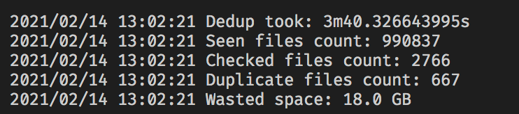

# dedup
Compares files by size, and crc32. Outputs json result with `-json`



## Features and TODOs
- [x] handle case where two files have exact same size but different content
- [ ] configurable filter
- [ ] tests
- [x] works on macOS
- [ ] works on linux
- [ ] works on windows
- [ ] Option to exclude mac packages
- [ ] Option to exclude invisible files
- [ ] Option to exclude 0 size files
- [ ] Option to provide a custom file filter like "*.jpg"

## Usage and example
```
$ dedup
  -d string
        starting directory
  -json
        output result as json
  -minsize int
        minimum filesize in bytes, default 30MiB (default 31457280)
$ dedup -d ~ -minsize $(( 1000*1000*10 )) -json > duplicates.json
```

## Notes
* godirwalk does not give us the stat result.
* godirwalk also calls callback for folders

## links
* https://github.com/karrick/godirwalk
